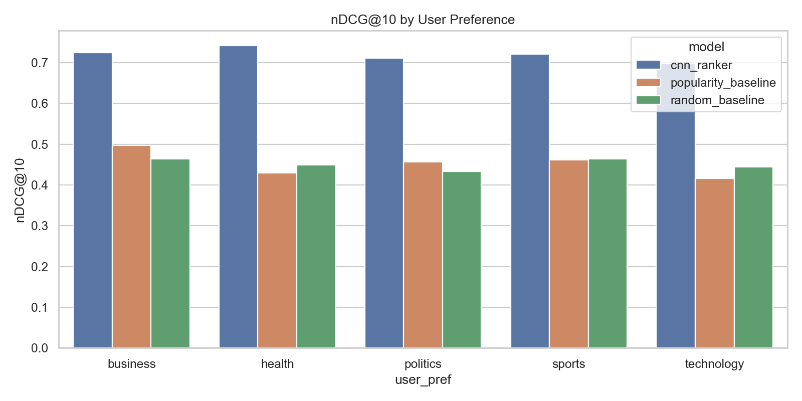
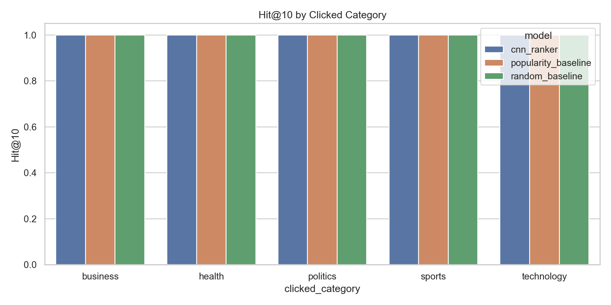
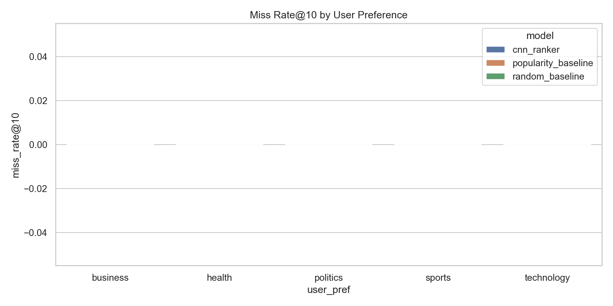

# Final Report (Generated from Artifacts)

## 1. Problem and Objective
This project builds a personalized recommendation pipeline that ranks text items and evaluates recommendation quality with retrieval metrics. The pipeline includes NLP/CNN modeling and an RL contextual bandit simulation.

## 2. Dataset
Final dataset used in this project: **synthetic_newsrec_v1** generated by `data/get_data.py`.

- No PII and no real user data.
- Split strategy: train/val/test by impression time ordering (70/15/15).

## 3. Main Results
|   nDCG@10 |   Hit@10 |   num_impressions | model               |
|----------:|---------:|------------------:|:--------------------|
|  0.449916 |        1 |               360 | random_baseline     |
|  0.450666 |        1 |               360 | popularity_baseline |
|  0.717259 |        1 |               360 | cnn_ranker          |

## 4. Ablation Results
| ablation               | overrides                                   |   nDCG@10 |   Hit@10 |
|:-----------------------|:--------------------------------------------|----------:|---------:|
| ablation_small_filters | {'filter_sizes': [2, 3], 'num_filters': 64} |  0.702776 |        1 |
| ablation_high_dropout  | {'dropout': 0.5}                            |  0.717259 |        1 |

## 5. Slice Analysis (Rubric Coverage)
### 5.1 By User Preference Subgroup
| user_pref   | model               |   nDCG@10 |   Hit@10 |   miss_rate@10 |   num_impressions |
|:------------|:--------------------|----------:|---------:|---------------:|------------------:|
| business    | cnn_ranker          |  0.724192 |        1 |              0 |                60 |
| health      | cnn_ranker          |  0.740834 |        1 |              0 |                60 |
| politics    | cnn_ranker          |  0.710714 |        1 |              0 |                80 |
| sports      | cnn_ranker          |  0.720396 |        1 |              0 |                80 |
| technology  | cnn_ranker          |  0.697784 |        1 |              0 |                80 |
| business    | popularity_baseline |  0.497249 |        1 |              0 |                60 |
| health      | popularity_baseline |  0.429301 |        1 |              0 |                60 |
| politics    | popularity_baseline |  0.45636  |        1 |              0 |                80 |
| sports      | popularity_baseline |  0.460916 |        1 |              0 |                80 |
| technology  | popularity_baseline |  0.415809 |        1 |              0 |                80 |
| business    | random_baseline     |  0.46318  |        1 |              0 |                60 |
| health      | random_baseline     |  0.449391 |        1 |              0 |                60 |
| politics    | random_baseline     |  0.432636 |        1 |              0 |                80 |
| sports      | random_baseline     |  0.46404  |        1 |              0 |                80 |
| technology  | random_baseline     |  0.443518 |        1 |              0 |                80 |

### 5.2 By Clicked Category Subgroup
| clicked_category   | model               |   nDCG@10 |   Hit@10 |   miss_rate@10 |   num_impressions |
|:-------------------|:--------------------|----------:|---------:|---------------:|------------------:|
| business           | cnn_ranker          |  0.754724 |        1 |              0 |                54 |
| health             | cnn_ranker          |  0.697133 |        1 |              0 |                66 |
| politics           | cnn_ranker          |  0.758235 |        1 |              0 |                71 |
| sports             | cnn_ranker          |  0.696073 |        1 |              0 |                84 |
| technology         | cnn_ranker          |  0.695793 |        1 |              0 |                85 |
| business           | popularity_baseline |  0.503051 |        1 |              0 |                54 |
| health             | popularity_baseline |  0.422455 |        1 |              0 |                66 |
| politics           | popularity_baseline |  0.441806 |        1 |              0 |                71 |
| sports             | popularity_baseline |  0.487487 |        1 |              0 |                84 |
| technology         | popularity_baseline |  0.410305 |        1 |              0 |                85 |
| business           | random_baseline     |  0.458396 |        1 |              0 |                54 |
| health             | random_baseline     |  0.445903 |        1 |              0 |                66 |
| politics           | random_baseline     |  0.450193 |        1 |              0 |                71 |
| sports             | random_baseline     |  0.458515 |        1 |              0 |                84 |
| technology         | random_baseline     |  0.438915 |        1 |              0 |                85 |

### 5.3 Error Analysis (Hard Failures)
Top difficult impressions by clicked-item rank:
|   impression_id |   user_id | user_pref   | clicked_category   |   nDCG@10 |   Hit@10 |   click_rank |   is_miss | model           |
|----------------:|----------:|:------------|:-------------------|----------:|---------:|-------------:|----------:|:----------------|
|            2049 |       102 | politics    | politics           |  0.289065 |        1 |           10 |         0 | random_baseline |
|            2066 |       103 | sports      | sports             |  0.289065 |        1 |           10 |         0 | random_baseline |
|            2095 |       104 | technology  | technology         |  0.289065 |        1 |           10 |         0 | random_baseline |
|            2102 |       105 | business    | business           |  0.289065 |        1 |           10 |         0 | random_baseline |
|            2110 |       105 | business    | business           |  0.289065 |        1 |           10 |         0 | random_baseline |
|            2112 |       105 | business    | technology         |  0.289065 |        1 |           10 |         0 | random_baseline |
|            2117 |       105 | business    | business           |  0.289065 |        1 |           10 |         0 | random_baseline |
|            2119 |       105 | business    | business           |  0.289065 |        1 |           10 |         0 | random_baseline |
|            2131 |       106 | health      | health             |  0.289065 |        1 |           10 |         0 | random_baseline |
|            2134 |       106 | health      | health             |  0.289065 |        1 |           10 |         0 | random_baseline |
|            2143 |       107 | politics    | health             |  0.289065 |        1 |           10 |         0 | random_baseline |
|            2156 |       107 | politics    | politics           |  0.289065 |        1 |           10 |         0 | random_baseline |
|            2158 |       107 | politics    | health             |  0.289065 |        1 |           10 |         0 | random_baseline |
|            2164 |       108 | sports      | technology         |  0.289065 |        1 |           10 |         0 | random_baseline |
|            2167 |       108 | sports      | sports             |  0.289065 |        1 |           10 |         0 | random_baseline |

## 6. Visual Analysis
- 
- 
- 

## 7. Ethics and Limitations
- Current data is synthetic, so external validity is limited.
- Offline evaluation may not reflect online user behavior shifts.
- Bias and fairness checks are subgroup-based and should be expanded for production-like data.

## 8. Reproducibility
Run the full flow:

```bash
make repro
```

Or run analysis/report generation directly:

```bash
python src/analyze_slices.py
python src/generate_assets.py
```
